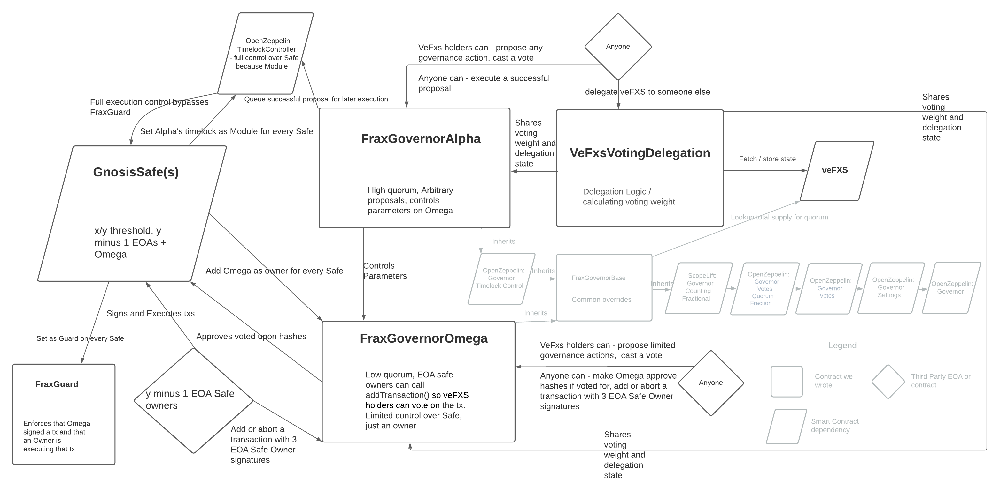
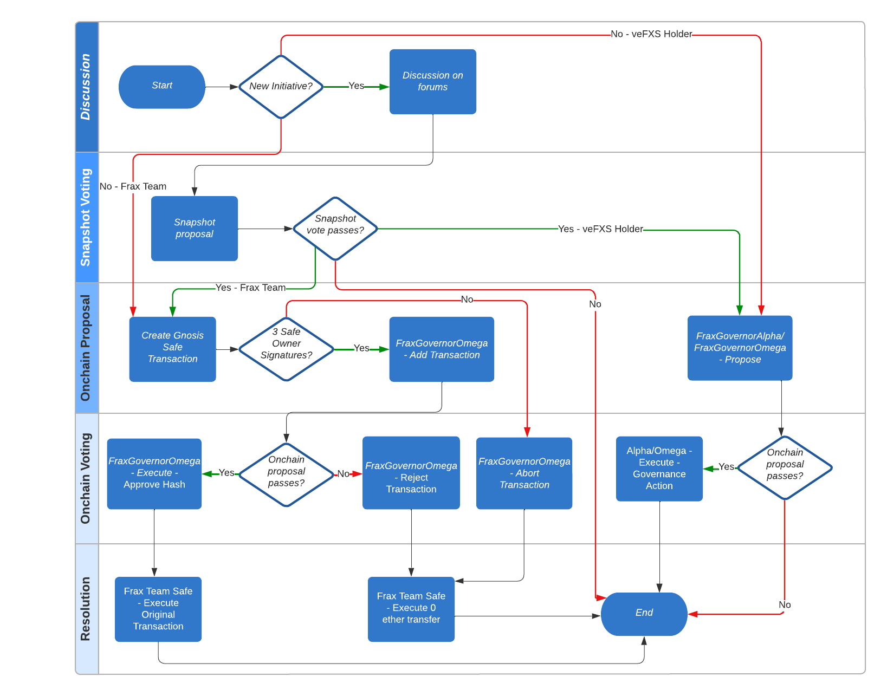

# Frax Governance

## Overview

Frax Governance is Frax Finances' implementation of onchain governance. veFXS holders can propose arbitrary governance actions through FraxGovernorAlpha. FraxGovernorAlpha has a high quorum, and is used in rare situations and for one off governance parameter changes.

The Frax team has a special Governor contract called FraxGovernorOmega. Omega allows the Frax team to submit proposals corresponding to Gnosis Safe transactions. These proposals must be approved or vetoed by veFXS holders. These special proposals are optimistic, meaning that they succeed by default unless quorum is met, and they are vetoed. This ensures that the community must approve of any onchain action that the Frax team makes.

## Smart Contract Design



## End to End Governance Process



## FraxGovernorAlpha
High quorum. Must be set as a Module on underlying Gnosis Safes. It has full control over the Gnosis Safes. Only veFXS holders can call `propose()`. Alpha controls all governance parameters, including governance parameters on Omega.

### General Flow
Identical to OpenZeppelin Governor.

## FraxGovernorOmega
Low quorum. Signer on underlying Gnosis Safe, so limited control. Only veFXS holders can directly call `propose()`. This `propose()` is intended to be used very infrequently, for example, if someone wrongfully sent tokens to this address, they can be recovered using `propose()`.

### General Flow
#### DeFi transaction
1. An owner uses the Gnosis Safe to initiate a DeFi transaction. This produces a transaction hash that identifies the action to be approved or rejected by the other multisig owners.
2. ⅗ EOA sign the transaction through the UI
3. After 3 signatures are collected, anyone can call `fraxGovernorOmega.addTransaction(address teamSafe, TxHashArgs calldata args, bytes calldata signatures)` to begin onchain governance. The team is incentivized to do so because they cannot execute any Gnosis Tx without FraxGovernorOmega’s approval.
4. veFXS voters have a 2-day window of time to vote on the proposal.
5. If no quorum is met during the voting window, or there are more for than against votes on the proposal, anyone can call `execute()`. This calls `safe.approveHash()` from Omega under the hood. It provides the needed approval from FraxGovernorOmega, which will allow the gnosis transaction to be executed through the Gnosis UI.
6. If quorum is met and there are more against than for votes. The proposal gets vetoed by anyone calling `fraxGovernorOmega.rejectTransaction(address teamSafe, uint256 nonce)`. This will cause FraxGovernorOmega to sign a zero eth transfer gnosis transaction with the same nonce. Safe owners can then sign the same tx in the UI using the “replace transaction” functionality. Safe owners can then execute the zero eth transfer, incrementing the nonce. The original transaction can never be executed, because there is no approval from FraxGovernorOmega and the nonce has moved on, invalidating the original tx.

#### Abort Transaction Flow
This flow exists to stop a gnosis transaction that is deemed wrong or no longer needed.

1. 1 EOA owner starts a rejection transaction in the gnosis safe UI
2. ⅗ EOA sign the rejection tx
3. Anyone can call `fraxGovernorOmega.abortTransaction(address teamSafe, bytes calldata signatures)` which immediately causes Omega to approve the rejection tx (zero eth transfer) on the underlying gnosis safe with the provided nonce.
4. Safe Owners can now execute the approved transaction
5. This increments the nonce, rendering the original tx and accompanying veto proposal useless.
6. If the original transaction was already put into FraxGovernorOmega with `addNewTransaction()`, the underlying proposal will be marked `ProposalState.Canceled` so no one else can vote on it.

## Tests
To run tests you need to create a virtual env and install vyper 0.2.12. This is because we're using VyperDeployer,
which will deploy the actual veFXS.vy contract.

Steps:
```bash
virtualenv -p python --no-site-packages ~/vyper-venv # or python3 -m venv ~/vyper-venv
source ~/vyper-venv/bin/activate
cd ~/vyper-venv
pip install vyper==0.2.12
cd $PROJECT_DIR
forge test
```

### Coverage
`forge coverage --report lcov && genhtml lcov.info -o report --branch-coverage && open report/index.html`

## Deploy:
Make sure to update Constants.sol.

### Local Deploy:
 ```bash
forge script script/test/DeployTestFxs.s.sol:DeployTestFxs --fork-url http://localhost:8545 --broadcast
forge script script/test/DeployTestnet.s.sol:DeployTestnet --fork-url http://localhost:8545 --broadcast
 ```

### Arbitrum Deploy (test):
```bash
forge script script/test/DeployTestFxs.s.sol:DeployTestFxs --rpc-url $ARBI_RPC_URL -vvvvv --verify --etherscan-api-key $ARBISCAN_KEY --verifier-url $ARBISCAN_API_URL
forge script script/test/DeployTestnet.s.sol:DeployTestnet --rpc-url $ARBI_RPC_URL -vvvvv --verify --etherscan-api-key $ARBISCAN_KEY --verifier-url $ARBISCAN_API_URL
```

### Deploying MockVeFxs on Arbitrum:
1. Go to Remix
2. Install Vyper Remix plugin
3. Bump `veFXS.py` version to 0.2.16
4. Deploy through remix
5. Verify on arbiscan, Remix will give you the abi encoded parameters

### Contract Verification
```bash
forge verify-contract $CONTRACT_ADDRESS src/VeFxsVotingDelegation.sol:VeFxsVotingDelegation --verifier-url $ARBISCAN_API_URL --etherscan-api-key $ARBISCAN_KEY --chain 42161 --constructor-args $CONSTRUCTOR_ARGS --show-standard-json-input
```
